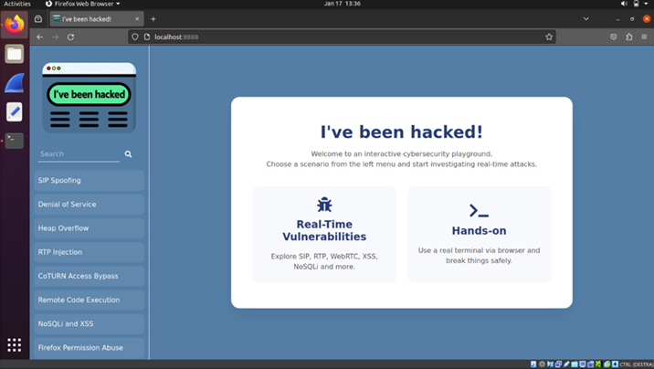

# I've been hacked!
This web application allows user to test and study different types of attack scenarios targeting real-time communication infrastructures.



## Scenarios
The following attacks are included:
- SIP Spoofing and SIP Flooding
- SIP Overflow
- RTP Injection
- Relay Abuse
- Remote Code Execution
- NoSQLi and XSS
- Permission Abuse

## Requirements
To use this web application, you need to have:
- nodejs
- docker
- docker-compose
- git
- make

Additionally, the following applications are required:
- Linphone
- Wireshark
- Firefox

## Setup
After installing the required software, clone the repository and move into the project directory:
```bash
git clone https://github.com/WebRTC-Thesis-Unina/RTC_Attacks
cd RTC_Attacks
```
Install the dependencies and start the web application:
```bash
npm install
node server.js
```

After that you can connect at: ```http://localhost:8888```