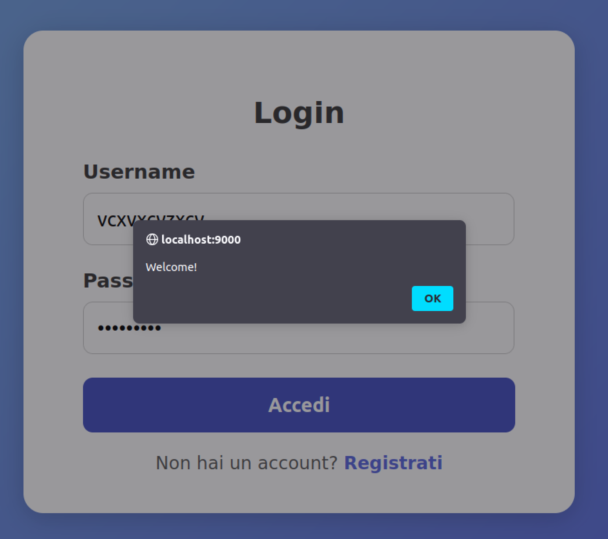
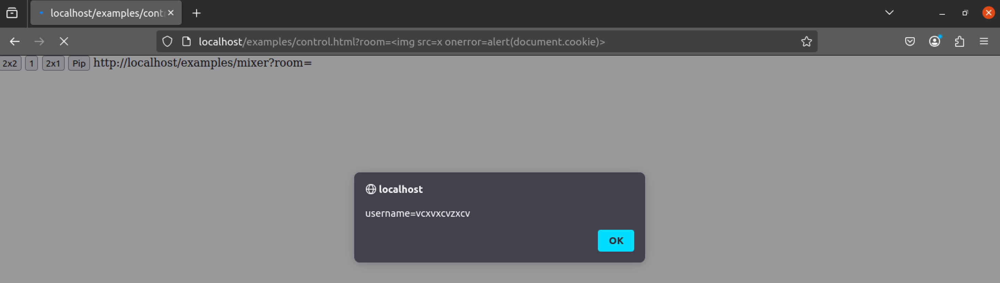

# NoSQLi and XSS
- Vulnerable components: mongoose library, VDO.Ninja
- Affected versions:
    - for mongoose: ≤ 5.7.4
    - for VDO.Ninja: 28.0
- CVE IDs: [CVE-2019-17426](https://nvd.nist.gov/vuln/detail/CVE-2019-17426), [CVE-2025-62613](https://nvd.nist.gov/vuln/detail/CVE-2025-62613)

## Description
In this scenario, by inserting specific input values, it is possible to bypass login controls and access the VDO.Ninja platform. Then, using a particular query string, sensitive information (e.g., cookies) can be extracted.

### Quick automation with Makefile
To test the scenario, you can run:
```bash
make run-nuclei
```

This will:
1. Build the Nuclei image;
2. Run Nuclei;
3. Use the custom template to check whether the vulnerability is present.

## How to reproduce the issue - NoSQLi
The web page is accessed through a browser at: ```http://localhost:9000```. In the vulnerable versions, the ```_bsontype``` attribute is ignored by server, and therefore by entering any username or password, access is granted:



## Mitigations
- Update to patched versions.
- Improve server-side validation controls.

## How to reproduce the issue - XSS
After being redirected to: ```http://localhost:80```, a new attack can be performed. 

For the vulnerable versions, there is no sanification of this particular input.

### Exploit the vulnerability
Using:
```bash
http://localhost:80/examples/control.html?room=
```
the page’s cookies are obtained:



## Mitigation
- Update to patched version.