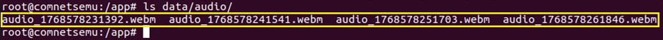

# Permission Abuse
- Vulnerable components: Firefox and Firefox ESR
- Affected versions:
    - for Firefox: < 69
    - for Firefox ESR: < 68.1
- CVE ID: [CVE-2019-11748](https://nvd.nist.gov/vuln/detail/CVE-2019-11748)

## Description
In this scenario, after launching the phishing campaign, the user receives the email. He decides to click the button and is redirected to the landing page managed by the attacker. On this page, he enters his data, which is captured by the attacker, and is then redirected to his intended web page. On this page, the user grants permissions to access the microphone. Believing these permissions are used for chat purposes, the user inadvertently allows the attacker to access the audio stream, which can then be used on third-party sites.

## How to reproduce the issue
### Step 1: Create a phising mail
To run Firefox with a graphical interface from the container, it is necessary to allow local root users to access the host display. On the host machine, execute:
```bash
xhost +local:root
```
Then start firefox container:
```bash
docker exec -it firefox bash
firefox
```
In another terminal, access the GoPhish container and start the service:
```bash
docker exec -it gophish bash
./gophish
```
Next, open ```https://127.0.0.1:3333``` in the Firefox. Log in using ```admin``` as the username and ```admin123``` as the password.

As first step, create a sending profile. 

To do this, create a Gmail account that can be used to send emails. Use this account to populate the fields "SMTP From" and "Username". As the password, you can use your account password or an App password (in this case, two-factor authentication must be  enabled). 

The sending profile is shown below:


The landing page (used to capture user credentials after clicking the email link) is already configured:


The email template used for the phishing message is also already available. You only need to configure the "Envelope Sender" field:


Define the group of target users who will receive the phishing email - use your email:


Finally, create and launch a new campaign by selecting:
- the sending profile;
- the landing page;
- the email template;
- the target groups.

**Note**: Set as URL: ```http://localhost:81```


### Step 2: Fall into the trap
The effect is that the email is delivered to the user:


The user clicks the button and is redirected to the landing page:


By entering their credentials, the user is in fact providing them to the attacker:


### Step 3: Exploit the vulnerability
At this point, the user is redirected to the attacker’s page. By granting access to the microphone (and checking the *'Remember this decision'* option) for what appears to be a conversation, the user is effectively allowing the attacker to reuse these permissions on third-party pages (```home.html```).

On ```home.html```, by exploiting the previously granted premission, the attacker can capture the user's audio and save it. 

Access on ```node_firefox``` container:

```bash
docker exec -it node_firefox bash
```
then navigate to the ```data/audio``` directory to view the user's recorded audio:



## Mitigation
- Update to patched version.